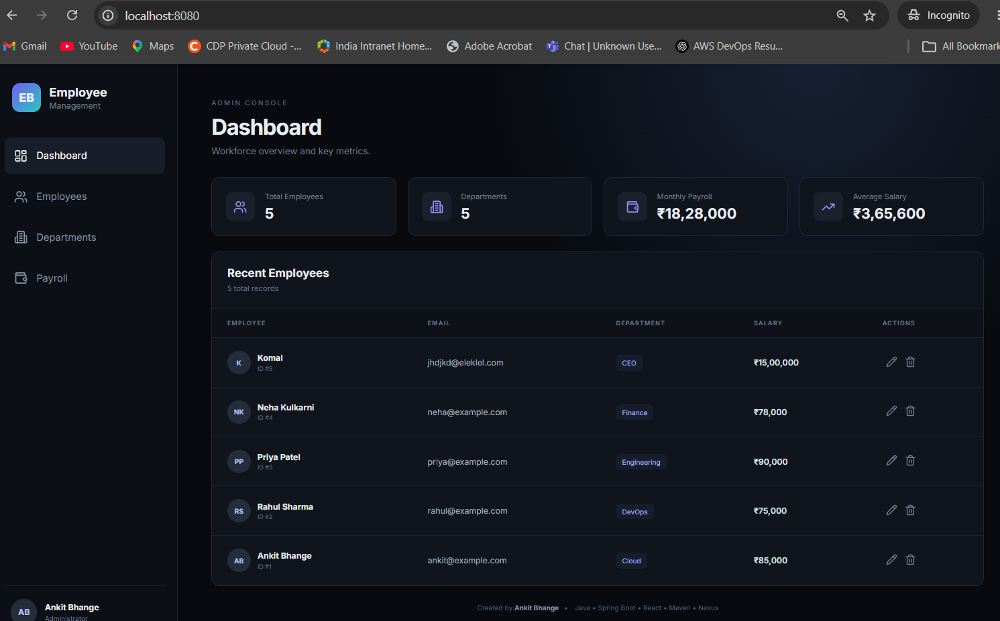

# Employee Management

Full-stack dark professional Employee Management application.



Java • Spring Boot • React • Maven • Nexus
# Employee Management System

A **full-stack Employee Management System** built using **Spring Boot, React, Maven, Spring Data JPA, and H2 Database**.

The project provides a modern dark-themed web interface for managing employees, viewing department statistics, and monitoring payroll information.

> Java • Spring Boot • React • Maven • Nexus

---

## Project Overview

The Employee Management System is a full-stack web application designed to demonstrate how a modern Java application can be developed, tested, packaged, and prepared for artifact management using **Maven and Nexus Repository**.

The application consists of:

* A **React + Vite frontend**
* A **Spring Boot REST API backend**
* **Spring Data JPA** for database operations
* **H2 Database** for development and testing
* **JUnit / Spring MVC tests**
* **Maven** for dependency management, testing, building, and packaging
* **Nexus Repository** for storing the generated Maven artifact

The frontend communicates with the backend through REST APIs.

---

# Architecture

```text
                    ┌─────────────────────┐
                    │      User / Browser  │
                    └──────────┬──────────┘
                               │
                               ▼
                    ┌─────────────────────┐
                    │   React Frontend    │
                    │      + Vite          │
                    └──────────┬──────────┘
                               │
                         REST API Calls
                               │
                               ▼
                    ┌─────────────────────┐
                    │   Spring Boot API   │
                    │      Backend        │
                    └──────────┬──────────┘
                               │
                               ▼
                    ┌─────────────────────┐
                    │ Spring Data JPA     │
                    └──────────┬──────────┘
                               │
                               ▼
                    ┌─────────────────────┐
                    │    H2 Database      │
                    └─────────────────────┘


              Maven Build / Artifact Management
              
                    ┌─────────────────────┐
                    │      GitHub         │
                    │   Source Code       │
                    └──────────┬──────────┘
                               │
                               ▼
                    ┌─────────────────────┐
                    │       Maven         │
                    │ Test / Build /      │
                    │ Package / Deploy    │
                    └──────────┬──────────┘
                               │
                               ▼
                    ┌─────────────────────┐
                    │  Nexus Repository   │
                    │                     │
                    │ employee-management │
                    │       JAR           │
                    └─────────────────────┘
```

---

# Features

## Dashboard

The Dashboard provides an overview of the organization.

It displays:

* Total number of employees
* Number of departments
* Total monthly payroll
* Average employee salary
* Recent employee records

Dashboard values are calculated dynamically from the employee data.

---

## Employee Management

The Employees section provides complete CRUD functionality.

### Create Employee

Users can create an employee with:

* Name
* Email
* Department
* Salary

### View Employees

The employee table displays:

* Employee ID
* Employee name
* Email
* Department
* Salary

### Update Employee

Existing employee information can be modified using the edit option.

### Delete Employee

Employees can be removed from the application using the delete action.

### Search Employee

Employees can be searched by:

* Name
* Email
* Department

---

# Department Management

The Departments section automatically groups employees based on their department.

For each department, the application displays:

* Department name
* Number of employees
* Monthly payroll

Example:

```text
Cloud
5 Employees
₹425,000 Monthly Payroll

DevOps
4 Employees
₹310,000 Monthly Payroll
```

Department information is generated dynamically from employee records.

---

# Payroll Management

The Payroll section provides salary-related information.

It displays:

* Total monthly payroll
* Average salary
* Employee salary details
* Employee department

Example:

```text
Employee              Department       Salary
------------------------------------------------
Ankit Bhange           Cloud            ₹85,000
Rahul Sharma           DevOps           ₹75,000
Priya Patel            Engineering      ₹90,000
```

Payroll information is calculated dynamically from employee salary data.

---

# Technology Stack

## Backend

| Technology      | Purpose                         |
| --------------- | ------------------------------- |
| Java 17         | Programming language            |
| Spring Boot     | Backend framework               |
| Spring Web      | REST API development            |
| Spring Data JPA | Database access                 |
| Hibernate       | ORM                             |
| H2 Database     | Development database            |
| Maven           | Build and dependency management |
| JUnit           | Unit testing                    |
| Spring MVC Test | Controller testing              |

## Frontend

| Technology   | Purpose                |
| ------------ | ---------------------- |
| React        | Frontend UI            |
| Vite         | Frontend build tool    |
| Axios        | REST API communication |
| Lucide React | UI icons               |
| CSS          | Dark professional UI   |

## DevOps / Artifact Management

| Technology       | Purpose                        |
| ---------------- | ------------------------------ |
| Git              | Source code management         |
| GitHub           | Source code repository         |
| Maven            | Build automation               |
| Nexus Repository | Artifact repository            |
| Jenkins          | Planned CI/CD integration      |
| Docker           | Planned containerization       |
| AWS ECR          | Planned container registry     |
| AWS ECS          | Planned application deployment |

---

# Project Structure

```text
employee-management/
│
├── frontend/
│   ├── src/
│   │   ├── main.jsx
│   │   └── styles.css
│   │
│   ├── index.html
│   ├── package.json
│   └── vite.config.js
│
├── src/
│   ├── main/
│   │   ├── java/
│   │   │   └── com/
│   │   │       └── ankit/
│   │   │           └── employee/
│   │   │               │
│   │   │               ├── config/
│   │   │               │   └── DataInitializer.java
│   │   │               │
│   │   │               ├── controller/
│   │   │               │   └── EmployeeController.java
│   │   │               │
│   │   │               ├── exception/
│   │   │               │   ├── EmployeeNotFoundException.java
│   │   │               │   └── GlobalExceptionHandler.java
│   │   │               │
│   │   │               ├── model/
│   │   │               │   └── Employee.java
│   │   │               │
│   │   │               ├── repository/
│   │   │               │   └── EmployeeRepository.java
│   │   │               │
│   │   │               ├── service/
│   │   │               │   └── EmployeeService.java
│   │   │               │
│   │   │               └── EmployeeManagementApplication.java
│   │   │
│   │   └── resources/
│   │       └── application.properties
│   │
│   └── test/
│       └── java/
│           └── com/
│               └── ankit/
│                   └── employee/
│                       └── controller/
│                           └── EmployeeControllerTest.java
│
├── .gitignore
├── pom.xml
└── README.md
```

---

# Application Flow

When a user creates an employee:

```text
User
 │
 ▼
React Frontend
 │
 │ POST /api/employees
 ▼
Spring Boot Controller
 │
 ▼
Employee Service
 │
 ▼
Employee Repository
 │
 ▼
H2 Database
```

When employee information is requested:

```text
H2 Database
 │
 ▼
Repository
 │
 ▼
Service
 │
 ▼
Controller
 │
 │ JSON Response
 ▼
React Frontend
 │
 ▼
Dashboard / Employees / Departments / Payroll
```

---

# REST API

Base URL:

```text
http://localhost:8080/api
```

---

## Get All Employees

```http
GET /api/employees
```

Example:

```bash
curl http://localhost:8080/api/employees
```

---

## Get Employee by ID

```http
GET /api/employees/{id}
```

Example:

```bash
curl http://localhost:8080/api/employees/1
```

---

## Create Employee

```http
POST /api/employees
```

Request:

```json
{
  "name": "Ankit Bhange",
  "email": "ankit@example.com",
  "department": "Cloud",
  "salary": 85000
}
```

Example:

```bash
curl -X POST http://localhost:8080/api/employees \
-H "Content-Type: application/json" \
-d "{\"name\":\"Ankit Bhange\",\"email\":\"ankit@example.com\",\"department\":\"Cloud\",\"salary\":85000}"
```

---

## Update Employee

```http
PUT /api/employees/{id}
```

Example:

```bash
curl -X PUT http://localhost:8080/api/employees/1 \
-H "Content-Type: application/json" \
-d "{\"name\":\"Ankit Bhange\",\"email\":\"ankit@example.com\",\"department\":\"DevOps\",\"salary\":90000}"
```

---

## Delete Employee

```http
DELETE /api/employees/{id}
```

Example:

```bash
curl -X DELETE http://localhost:8080/api/employees/1
```

---

## Dashboard API

```http
GET /api/dashboard
```

Example response:

```json
{
  "totalEmployees": 4,
  "departments": 4,
  "monthlyPayroll": 328000.0,
  "averageSalary": 82000.0
}
```

---

## Departments API

```http
GET /api/departments
```

Example response:

```json
[
  {
    "name": "Cloud",
    "employeeCount": 1,
    "payroll": 85000.0
  },
  {
    "name": "DevOps",
    "employeeCount": 1,
    "payroll": 75000.0
  }
]
```

---

## Payroll API

```http
GET /api/payroll
```

Returns:

* Total payroll
* Average salary
* Employee salary information

---

# ⚙️ Prerequisites

Before running the project, install:

### Java

Java 17 or later.

Verify:

```bash
java -version
```

Expected:

```text
java version "17..."
```

### Maven

Maven 3.9 or later.

Verify:

```bash
mvn -version
```

### Node.js

Node.js 20 or later.

Verify:

```bash
node --version
npm --version
```

### Git

Verify:

```bash
git --version
```

---

# Running the Application

## 1. Clone the Repository

```bash
git clone YOUR_GITHUB_REPOSITORY
```

Navigate into the project:

```bash
cd employee-management
```

---

## 2. Run Tests

Execute:

```bash
mvn clean test
```

Maven will:

```text
Clean previous build
       ↓
Compile source code
       ↓
Compile tests
       ↓
Execute tests
       ↓
Generate test results
```

Expected:

```text
BUILD SUCCESS
```

---

# Build the Application

Run:

```bash
mvn clean package
```

Maven performs:

```text
Clean
  ↓
Compile
  ↓
Test
  ↓
Build React Frontend
  ↓
Package Frontend
  ↓
Create Spring Boot JAR
```

The generated artifact will be:

```text
target/employee-management-1.0.0.jar
```

---

# Run the JAR

Run:

```bash
java -jar target/employee-management-1.0.0.jar
```

Open:

```text
http://localhost:8080
```

---

# Frontend Development Mode

If you want to work on the React frontend separately:

Navigate to:

```bash
cd frontend
```

Install dependencies:

```bash
npm install
```

Start Vite:

```bash
npm run dev
```

The frontend will be available at:

```text
http://localhost:5173
```

Vite is configured to proxy API requests to:

```text
http://localhost:8080
```

---

# Testing

The project includes Spring MVC tests using JUnit.

Run:

```bash
mvn test
```

The tests validate REST endpoints such as:

```text
GET /api/employees
GET /api/dashboard
```

Test reports are generated under:

```text
target/surefire-reports/
```

---

# Database

The application currently uses an **H2 in-memory database**.

Configuration:

```properties
spring.datasource.url=jdbc:h2:mem:employeedb
spring.datasource.username=sa
spring.datasource.password=
spring.jpa.hibernate.ddl-auto=create-drop
```

The database is recreated when the application starts.

Therefore, employee data will be lost when the application is restarted.

### H2 Console

The H2 console is enabled.

Open:

```text
http://localhost:8080/h2-console
```

JDBC URL:

```text
jdbc:h2:mem:employeedb
```

Username:

```text
sa
```

Password:

```text
```

---

# Maven Artifact

The project uses the following Maven coordinates:

```text
Group ID:
com.ankit

Artifact ID:
employee-management

Version:
1.0.0

Packaging:
jar
```

Complete artifact identifier:

```text
com.ankit:employee-management:1.0.0
```

Generated artifact:

```text
employee-management-1.0.0.jar
```

---

# Maven Lifecycle

The main Maven lifecycle commands used in this project are:

```bash
mvn clean
mvn test
mvn package
mvn install
mvn deploy
```

### Clean

```bash
mvn clean
```

Removes the previous `target` directory.

### Test

```bash
mvn test
```

Compiles and executes tests.

### Package

```bash
mvn package
```

Creates the application JAR.

### Install

```bash
mvn install
```

Installs the artifact into the local Maven repository.

Usually:

```text
~/.m2/repository
```

On Windows:

```text
C:\Users\<username>\.m2\repository
```

### Deploy

```bash
mvn deploy
```

Uploads the artifact to the configured remote Maven repository such as Nexus.

---

# Nexus Repository Integration

This project is designed to publish its Maven artifact to **Sonatype Nexus Repository**.

The deployment flow is:

```text
GitHub
   ↓
Source Code
   ↓
Maven
   ↓
Compile
   ↓
Test
   ↓
Package
   ↓
employee-management-1.0.0.jar
   ↓
Nexus Repository
```

---

# Configure Nexus

## Set up Nexus

Run Nexus with Docker if you don't already have it:

```bash
docker run -d \
  --name nexus \
  -p 8081:8081 \
  sonatype/nexus3
```
Check:

```bash
docker ps
```
Then open:

http://localhost:8081

Get the initial password:
```bash
docker exec nexus cat /nexus-data/admin.password
```
Login:

Username: admin
Password: <password>
Step 10 — Create Maven repository

In Nexus:

Repositories
     ↓
Create repository
     ↓
maven2 (hosted)

Name:

maven-releases

Use:

Version policy: Release

For learning, you can select:

Deployment policy: Allow redeploy

Create the repository.

Your URL will be:

http://localhost:8081/repository/maven-releases/

Create a hosted Maven repository in Nexus.

Recommended repository name:

```text
maven-releases
```

Example Nexus URL:

```text
http://YOUR-NEXUS-SERVER:8081
```

Repository URL:

```text
http://YOUR-NEXUS-SERVER:8081/repository/maven-releases/
```

---

# Configure `pom.xml`

Add:

```xml
<distributionManagement>
    <repository>
        <id>nexus-releases</id>
        <name>Nexus Releases</name>
        <url>http://YOUR-NEXUS-SERVER:8081/repository/maven-releases/</url>
    </repository>
</distributionManagement>
```

---

# Configure Maven Credentials

Do **not** put Nexus credentials inside `pom.xml`.

Configure Maven credentials in:

### Windows

```text
C:\Users\<username>\.m2\settings.xml
```

Example:

```xml
<settings>
    <servers>
        <server>
            <id>nexus-releases</id>
            <username>YOUR_NEXUS_USERNAME</username>
            <password>YOUR_NEXUS_PASSWORD</password>
        </server>
    </servers>
</settings>
```

The server ID must match:

```xml
<id>nexus-releases</id>
```

from `pom.xml`.

---

# Deploy Artifact to Nexus

Run:

```bash
mvn clean deploy
```

Maven will:

```text
1. Clean previous build
        ↓
2. Compile Java
        ↓
3. Run tests
        ↓
4. Build React frontend
        ↓
5. Package Spring Boot JAR
        ↓
6. Install artifact
        ↓
7. Upload artifact to Nexus
```

After successful deployment, Nexus will contain:

```text
maven-releases
    │
    └── com
        └── ankit
            └── employee-management
                └── 1.0.0
                    ├── employee-management-1.0.0.jar
                    ├── employee-management-1.0.0.pom
                    └── metadata files
```

---

# Security Best Practices

Never commit:

```text
settings.xml
```

or credentials such as:

```text
NEXUS_USERNAME
NEXUS_PASSWORD
AWS_ACCESS_KEY
AWS_SECRET_KEY
```

The project `.gitignore` excludes Maven credentials and environment files.

For CI/CD, credentials should be stored securely using:

* Jenkins Credentials
* GitHub Secrets
* AWS Secrets Manager
* Environment variables

---

# Git Workflow

Initialize the repository:

```bash
git init
```

Check status:

```bash
git status
```

Add files:

```bash
git add .
```

Commit:

```bash
git commit -m "Initial Employee Management application"
```

Create main branch:

```bash
git branch -M main
```

Connect GitHub:

```bash
git remote add origin YOUR_GITHUB_REPOSITORY
```

Push:

```bash
git push -u origin main
```

---

# Recommended DevOps CI/CD Pipeline

The project can be extended into a complete DevOps pipeline.

```text
                         Developer
                             │
                             ▼
                         GitHub
                             │
                             │ Webhook
                             ▼
                         Jenkins
                             │
                    ┌────────┴────────┐
                    │                 │
                    ▼                 ▼
                  Maven             Tests
                 Build              JUnit
                    │                 │
                    └────────┬────────┘
                             │
                             ▼
                          Package
                             │
                             ▼
                           Nexus
                             │
                             ▼
                          Docker
                             │
                             ▼
                           AWS ECR
                             │
                             ▼
                          AWS ECS
                             │
                             ▼
                    Application Load
                       Balancer
                             │
                             ▼
                           Users
```

---

# 🐳 Future Docker Integration

The application can be containerized using Docker.

Example future workflow:

```bash
docker build -t employee-management:1.0.0 .
```

Run:

```bash
docker run -p 8080:8080 employee-management:1.0.0
```

The Docker image can then be pushed to:

```text
Amazon ECR
```

and deployed using:

```text
Amazon ECS
```

---

# Future AWS Deployment

The project can be extended to AWS using:

```text
GitHub
   ↓
Jenkins
   ↓
Maven
   ↓
Nexus
   ↓
Docker Image
   ↓
Amazon ECR
   ↓
Amazon ECS
   ↓
Application Load Balancer
   ↓
Users
```

Potential AWS services:

* Amazon ECS
* Amazon ECR
* Application Load Balancer
* Amazon VPC
* Amazon CloudWatch
* IAM
* Amazon RDS
* Route 53

The H2 database can later be replaced with **Amazon RDS MySQL** for a production-style deployment.

---

# 🛠️ Troubleshooting

## Port 8080 Already in Use

If you receive:

```text
Web server failed to start.
Port 8080 was already in use.
```

On Windows:

```powershell
netstat -ano | findstr :8080
```

Identify the process:

```powershell
tasklist | findstr <PID>
```

Stop the process if appropriate:

```powershell
Stop-Process -Id <PID> -Force
```

Alternatively, change the application port in:

```text
src/main/resources/application.properties
```

For example:

```properties
server.port=8081
```

Then access:

```text
http://localhost:8081
```

---

# Important Notes

### H2 Database

This project currently uses an in-memory H2 database.

Data will be reset when the application restarts.

### Nexus

Nexus credentials must never be committed to GitHub.

### Frontend

The React frontend is built by Maven during:

```bash
mvn clean package
```

The generated frontend files are packaged into the Spring Boot application.

Therefore, the application can be run as a single JAR:

```bash
java -jar target/employee-management-1.0.0.jar
```

---

# Future Enhancements

Planned improvements include:

* [ ] MySQL / Amazon RDS integration
* [ ] Spring Security authentication
* [ ] JWT-based authorization
* [ ] Role-based access control
* [ ] Docker containerization
* [ ] Jenkins CI/CD pipeline
* [ ] Nexus artifact management
* [ ] Amazon ECR integration
* [ ] Amazon ECS deployment
* [ ] Application Load Balancer
* [ ] CloudWatch monitoring
* [ ] HTTPS using ACM
* [ ] Route 53 domain
* [ ] SonarQube code-quality analysis
* [ ] Automated security scanning

---

# DevOps Skills Demonstrated

This project demonstrates practical experience with:

```text
Java
Spring Boot
REST API
React
JPA / Hibernate
H2
Maven
JUnit
Git
GitHub
Nexus Repository
Docker
Jenkins
AWS ECR
AWS ECS
Application Load Balancer
CloudWatch
IAM
```

---

# Application Screens

The application contains the following main screens:

```text
Dashboard
    │
    ├── Total Employees
    ├── Departments
    ├── Monthly Payroll
    └── Average Salary

Employees
    │
    ├── Add Employee
    ├── Edit Employee
    ├── Delete Employee
    └── Search

Departments
    │
    ├── Department Count
    └── Department Payroll

Payroll
    │
    ├── Total Payroll
    ├── Average Salary
    └── Employee Salary Details
```

---

# Author

## Created by Ankit Bhange

**AWS Cloud Engineer | DevOps Engineer**

Technology Focus:

```text
AWS • DevOps • Java • Spring Boot • React • Maven • Nexus • Docker • Jenkins
```

---

#  If You Find This Project Useful

If this project helps you learn or demonstrates a useful DevOps workflow, consider giving the repository a ⭐ on GitHub.

---

## License

This project is intended for learning, portfolio, and demonstration purposes.
